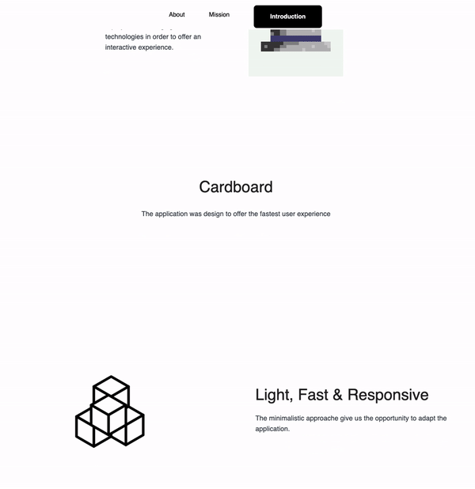
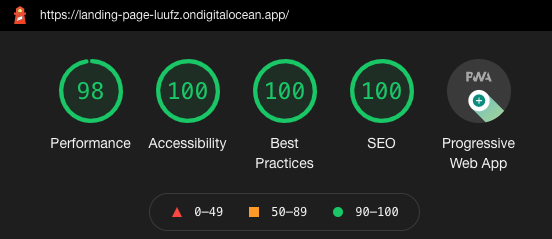

# Next JS - Landing Page

This is a free React landing page template written in JavaScript, designed for startups, who want to create a quick, clean and professional landing page for their business or project.



### Features

- :evergreen_tree: Modern

- :hear_no_evil: Responsive

- :vulcan_salute: Contact Form

- :bread: Low Maintenance

## SEO Friendly



## Installation

```
git clone https://github.com/poboisvert/LandingPage.git
cd template && npm install
npm run dev
```

## Deploy with Digital Ocean

- https://www.digitalocean.com/community/tutorials/how-to-deploy-a-next-js-app-to-app-platform

## Deploy a NPM package

```
npm login

cd template && git init && git add . && git commit -m "init"

npm publish --access public

npm i @YOUR_ORGANISATION/PACKAGE_NAME

Note: npm version patch
```

- https://zellwk.com/blog/publish-to-npm/
